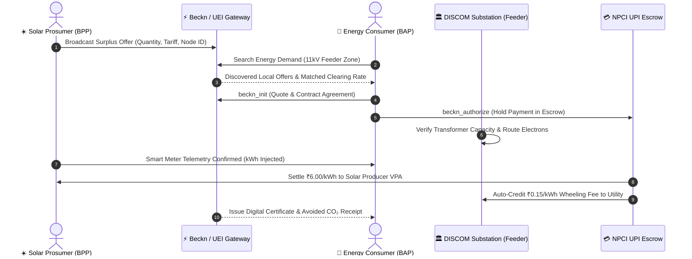

# ⚡ JanUrja — Universal Energy Interface (UEI)

<p align="center">
  
</p>

<p align="center">
  <strong>"UPI for Electricity" — Autonomous Peer-to-Peer Rooftop Solar Energy Trading</strong><br>
  <em>Built for NITK Surathkal Hackathon • Track 3: Reinvent Digital Public Infrastructure For Billions</em>
</p>

<p align="center">
  <a href="https://nitk-surathkal-janurja.vercel.app"></a>
  <a href="https://github.com/Nishant-Kumar-007/JanUrja_NITK"></a>
</p>

<p align="center">
  
  
  
  
  
  
</p>

---

## 🌟 Live Production Links

* **Live Web Application:** [https://nitk-surathkal-janurja.vercel.app](https://nitk-surathkal-janurja.vercel.app)
* **GitHub Source Repository:** [https://github.com/Nishant-Kumar-007/JanUrja_NITK](https://github.com/Nishant-Kumar-007/JanUrja_NITK)
* **Comprehensive Project Context & Guide:** [PROJECT_CONTEXT_AND_SETUP.md](file:///c:/Users/nisha/Hackathon/NITK%20Surathkal%20JanUrja%20Hackathon/PROJECT_CONTEXT_AND_SETUP.md)

---

## 🎯 3-Minute Hackathon Judge Evaluation Walkthrough

| Step | Feature to Test | Where to Look | What to Observe |
|:---:|:---|:---|:---|
| **1** | **Live Telemetry & Dashboard** | [Home Dashboard](https://nitk-surathkal-janurja.vercel.app) | Inspect the 3 dynamic metric capsules: **32.5 kWh Generated** − **28.0 kWh USED** = **+4.5 kWh LEFT (Surplus)**. |
| **2** | **Full Interactive Wallet** | Top Navbar `₹ Balance` or Dashboard Capsule | Open the **JanUrja Escrow Wallet**. Deposit funds via Mock UPI/Card/NetBanking with live receipts, withdraw to bank via IMPS, and inspect the real-time passbook ledger. |
| **3** | **Interactive 90-Sec Demo** | Top Navbar Menu ➔ Demo Centerpiece | Watch autonomous Beckn state transitions (`DISCOVERED` ➔ `QUOTED` ➔ `AUTHORIZED` ➔ `ALLOCATED` ➔ `SETTLED`) with dual green Electron Flow and gold Financial UPI Flow animations. |
| **4** | **P2P Marketplace & Limit Orders** | Click `+ Buy Energy` or `↗ Sell Energy` | Place bids, test agentic price guards (*"Only buy if rate < ₹6.00/unit"*), and inspect itemized DISCOM wheeling charges (₹0.15/unit). |
| **5** | **Microgrid Compass Topology** | Directional Compass on Home / Marketplace | Filter and balance feeder segments: **S1-North** (NITK Research Park), **S2-East** (Commercial Market), **S3-South** (EV Corridor), and **Central Hub** (MESCOM Substation). |
| **6** | **DISCOM Utility & Duck Curve View** | Top Navbar Menu ➔ DISCOM Dashboard | View real-time Duck Curve mitigation analytics proving how utilities earn guaranteed wheeling transit revenue without default risk. |

---

## ⚡ The Problem: India's Clean Energy Bottleneck

Under initiatives like **PM Surya Ghar: Muft Bijli Yojana**, millions of Indian homes and institutions are installing rooftop solar PV systems. However, the current model is fundamentally broken:

1. **Unfair Net-Metering Economics:** Prosumers feed surplus midday solar back into the state grid for nominal credits (₹2.00–₹2.50/kWh) with delayed 6-month adjustment cycles.
2. **Punitive Commercial Tariffs:** Neighboring bakeries, hospitals, and EV charging hubs only 50 meters away pay ₹7.50–₹9.00/kWh commercial grid tariffs.
3. **Grid Stress & The "Duck Curve":** Uncoordinated midday solar injection strains distribution transformers (DTs) and causes reverse power flows on 11kV feeders.

---

## 💡 The Solution: JanUrja over Beckn (UEI)

**JanUrja** reimagines electricity distribution as an open **Digital Public Infrastructure (DPI)**:

* **Unbundled Energy Exchange:** Rooftop solar prosumers sell directly to deficit neighbors at a fair negotiated clearing price (e.g., ₹6.15/kWh).
* **Guaranteed DISCOM Revenue:** State utilities (MESCOM/BESCOM) do not lose out — they earn a mandatory **₹0.15/kWh Wheeling Transit Fee** on every transacted unit for carrying electrons across their 11kV lines.
* **Instant NPCI UPI Settlement:** Buyers pay through UPI AutoPay; escrow smart contracts credit solar producers instantly upon smart meter telemetry verification.



---

## 🛠️ Architecture & Core Components

```
NITK Surathkal JanUrja Hackathon/
├── src/
│   ├── components/
│   │   ├── WalletModal.jsx          # Interactive Mock Payment Gateway & Payout Engine
│   │   ├── DirectionalCompass.jsx   # Microgrid Feeder Zone Segment Visualizer
│   │   ├── EnergyFlowAnimation.jsx  # Dual Electron & Financial Flow Canvas
│   │   ├── LiveProtocolMonitor.jsx  # Realtime Beckn BAP/BPP Handshake Auditor
│   │   ├── ZerodhaTicker.jsx        # High-density market overview & grid frequency
│   │   ├── BecknPayloadModal.jsx    # Raw protocol payload inspector
│   │   ├── ReceiptModal.jsx         # Verified CO₂ reduction & QR energy bill
│   │   └── Chatbot.jsx              # AI assistant trained on UEI & Solar FAQs
│   ├── views/
│   │   ├── HomeView.jsx             # Main dashboard (Generation, Usage, Net Left)
│   │   ├── BuyView.jsx              # Standalone order execution with limit guards
│   │   ├── SellView.jsx             # Listing portal with Agentic Pricing Rules
│   │   ├── MarketplaceView.jsx      # Live peer order book & feeder filter
│   │   ├── DemoFlowView.jsx         # 90-Second step-by-step hackathon centerpiece
│   │   ├── DiscomDashboardView.jsx  # Duck curve analytics & grid stability metrics
│   │   └── WalletView.jsx           # Full canvas passbook ledger
│   ├── services/
│   │   ├── becknProtocol.js         # Beckn v1.1.0 UEI state machine & schema validator
│   │   ├── walletService.js         # Dual-engine escrow ledger & IMPS/UPI payouts
│   │   ├── supabaseClient.js        # Hybrid client (Live Supabase Cloud + Local Fallback)
│   │   ├── mockDatabase.js          # In-memory/localStorage reactive event bus
│   │   └── agenticEngine.js         # NLP bidding rules engine
│   └── data/
│       └── initialData.js           # NITK Surathkal & Coastal Grid realistic telemetry
├── supabase/
│   └── schema.sql                   # Production PostgreSQL DDL with Row Level Security
├── vercel.json                      # Single Page Application rewrite rules
└── package.json                     # Vite + React 19 dependencies
```

---

## 🏆 Key Innovations

### 1. Dual-Engine Resilience (100% Zero-Config Offline + Live Cloud)
* **Zero Failure Risk During Demos:** JanUrja ships with a hybrid database facade (`supabaseClient.js` + `mockDatabase.js`). It runs **100% offline out-of-the-box** using reactive local storage pub/sub event emitters.
* **Instant Cloud Upgrade:** Simply add your Supabase credentials in the web UI Settings drawer or `.env` to enable real-time multi-device PostgreSQL synchronization.

### 2. Interactive Mock Gateway & Wallet
* **Instant Deposit:** Supports UPI VPAs (`prosumer@okaxis`), credit/debit cards, and Net Banking simulation.
* **Instant 24x7 IMPS Payouts:** Withdraw energy earnings directly to beneficiary bank accounts with automatic IFSC detection.
* **Audited Passbook:** Immutable transaction log tracking reference IDs, statuses, and ledger deltas.

### 3. Agentic Solar Pricing Engine
* Prosumers can set natural language dynamic bidding rules:
  > *"Undercut state utility tariff by 15%, but never sell below ₹5.50/kWh unless battery is above 90%."*
* Automatically adjusts offer quotes based on cloud cover, solar irradiance, and feeder demand.

### 4. DISCOM Co-existence & Duck Curve Shaving
* State utilities are incentivized partners rather than adversaries.
* By shifting demand to midday solar hours, local commercial consumers flatten the evening peak, reducing grid congestion while DISCOMs collect passive transmission revenue.

---

## 💻 Local Setup & Development

### Prerequisites
* **Node.js**: v18.0 or higher
* **npm**: v9.0 or higher

### Installation

```bash
# 1. Clone the repository
git clone https://github.com/Nishant-Kumar-007/JanUrja_NITK.git
cd JanUrja_NITK

# 2. Install dependencies
npm install

# 3. Start the local development server
npm run dev
```

Open [http://localhost:5173](http://localhost:5173) in your browser.

### Building for Production

```bash
npm run build
```

The production bundle will be generated in `dist/`.

---

## 🗄️ Database Schema (`supabase/schema.sql`)

| Table Name | Description | Key Attributes |
|:---|:---|:---|
| `profiles` | User accounts & roles | `id`, `full_name`, `role`, `wallet_balance`, `solar_capacity_kw`, `upi_id` |
| `energy_nodes` | Smart meters & telemetry | `smart_meter_id`, `current_generation_kwh`, `current_consumption_kwh`, `renewable_percentage` |
| `energy_offers` | Marketplace energy listings | `seller_id`, `price_per_kwh`, `quantity_kwh`, `pricing_mode`, `natural_rules` |
| `orders` | Transactional Beckn contracts | `order_id`, `protocol_state`, `buyer_id`, `seller_id`, `total_amount` |
| `transactions` | Financial settlements | `gateway_txn_id`, `amount`, `payer_vpa`, `payee_vpa`, `co2_avoided_kg` |
| `protocol_events` | Real-time Beckn audit trail | `action` (`search`, `init`, `confirm`, `settle`), `payload`, `timestamp` |

<p align="center">
  <sub>NITK Surathkal Hackathon • Track 3: Reinvent Digital Public Infrastructure For Billions • Build for Billions</sub>
</p>
